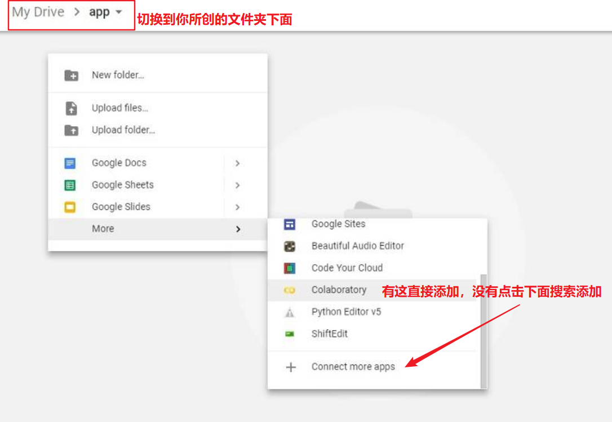
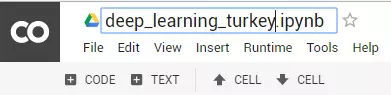
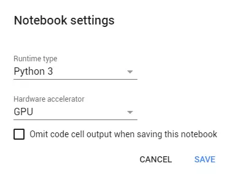
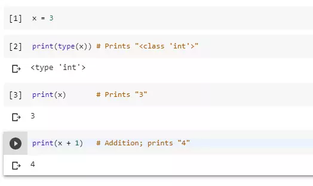
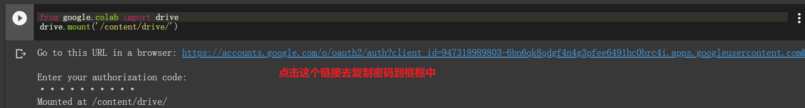
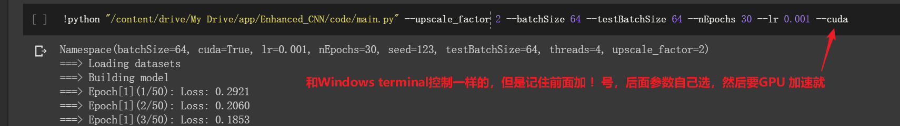

# 期中報告
>11024127 蘇家弘

# Colab是什麼？
_Google Colab 是一個免費的雲端服務並支援免費的 GPU，可以：_
>1. 提高你的 Python 語言的編碼技能。
>2. 使用 Keras、TensorFlow、PyTorch 和 OpenCV 等流行庫開發深度學習應用程式。
>3. Colab 與其它免費的雲端服務最重要的區別在於：Colab 提供完全免費的 GPU，為學生黨進行AI學習提供便>>利。

_Colab 是Google的且伺服器在國外_
>1. 如果不能使用Google，建議使用Kaggle（國內也能使用）👉免費的深度學習GPU環境Colab和Kaggle搭配使用
>2. 如果可以上Google，那就繼續往下看學習Colab用法！

# Colab的基本配置
_1. 登入 Google Drive_

_2. 在 Google Drive 上建立資料夾，我建立的是名字為 app 的資料夾_


_3. 建立新的 Colab 筆記（Notebook），透過 右鍵點擊 > More > Colaboratory 步驟建立一個新的筆記_



_透過點擊檔案名稱來重新命名筆記_



_4. 打開 GPU_

>Edit > Notebook settings 或進入 Runtime > Change runtime type，然後選擇 GPU 為 Hardware accelerator（硬體加速器）。



_5. 使用 Google Colab 運行基本的 Python 程式碼_

>這個倒是不常用，使用這個功能類似jupyter notebook，而我們要跑的程式碼基本上是已經編輯好的工程項目。利用colab主要是想透過GPU加速更快的訓練。


_6. 在建立的資料夾頁面上傳你的整個要跑的檔案(包括資料集)，右鍵選取upload fold 或直接拖曳也行_

# Colab模型訓練
_1. 加載盤_
```
from google.colab import drive
drive.mount('/content/drive/')
```


_2. 切換到你要跑的目錄下面_
```
# 指定目前的工作資料夾
import os
# 此處為google drive中的檔案路徑,drive為先前指定的工作根目錄，若要加上
os.chdir("/content/drive/MyDrive/LapSRN/")
```
_3. 安裝Pytorch以及torchvision_

>Colab 一般情況下已經自備了pytorch環境了。若沒有可以進行對應的安裝：
```
!pip install torch torchvision  # 在Colab中执行操作语句时，感叹号不能漏
```
_4. 執行訓練命令_


_5. 注意事項_
>最重要的是路徑問題，一般在data.py或dateset.py檔裡面有關於路徑的，還有save model時候。可以將路徑相關的都改成parse的語句，在執行指令時傳入防止出錯。相關的路徑可以直接複製
