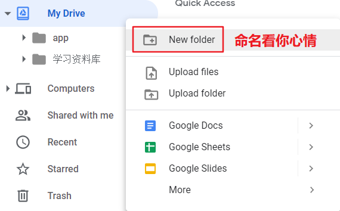

# 期中報告
>11024127 蘇家弘

_Colab是什麼？_
>Google Colab 是一個免費的雲端服務並支援免費的 GPU，可以：
>1. 提高你的 Python 語言的編碼技能。
>2. 使用 Keras、TensorFlow、PyTorch 和 OpenCV 等流行庫開發深度學習應用程式。
>3. Colab 與其它免費的雲端服務最重要的區別在於：Colab 提供完全免費的 GPU，為學生黨進行AI學習提供便>>利。

>Colab 是Google的且伺服器在國外
>1. 如果不能使用Google，建議使用Kaggle（國內也能使用）👉免費的深度學習GPU環境Colab和Kaggle搭配使用
>2. 如果可以上Google，那就繼續往下看學習Colab用法！

_Colab的基本配置_
>1. 登入 Google Drive
>2. 在 Google Drive 上建立資料夾，我建立的是名字為 app 的資料夾

>3. 
